:scrollbar:
:data-uri:
:toc2:

== AWS EC2 コンソール接続手順

本手順では AWS EC2 で作成したインスタンスに SSH 接続するまでの手順を示します。

.手順で利用する AWSパラメータ一覧
[cols="2,5,1",options="header"]
|====
| AMI | RHEL-7.4_HVM_GA-20170808-x86_64-2-Hourly2-GP2 (ami-30ef0556) |
| インスタンスタイプ | t2.micro (CPU:1 Mem:1GB)|
| AWS接続鍵 | aws_key.pem |
| ホスト名 | ec2-13-114-132-119.ap-northeast-1.compute.amazonaws.com | 
|====

==== インスタンスの作成

. AWS EC2 コンソールよりインスタンス作成ボタンをクリック
+
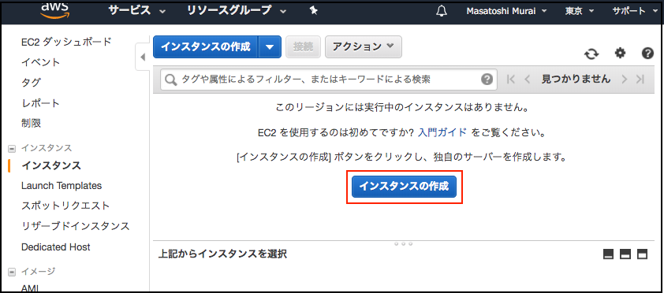

. RHEL7.4のAMI を選択
+
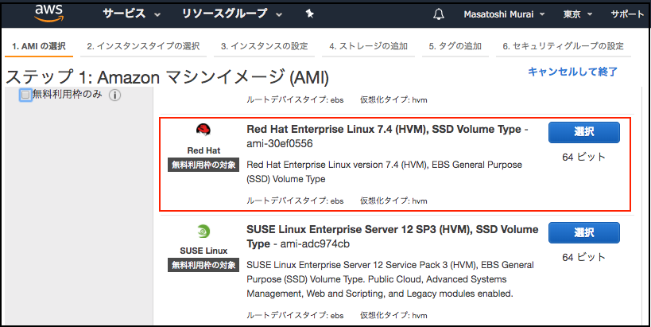

. t2.micro を選択し 確認と作成 をクリック
+
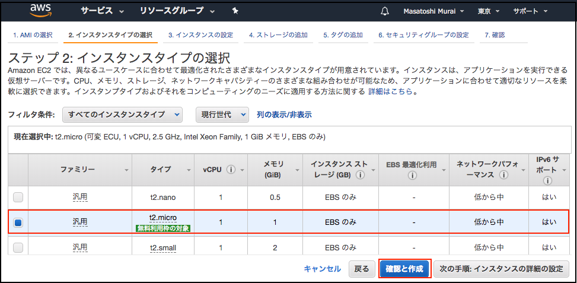

. 作成内容に不備がないことを確認し 作成 をクリック
+
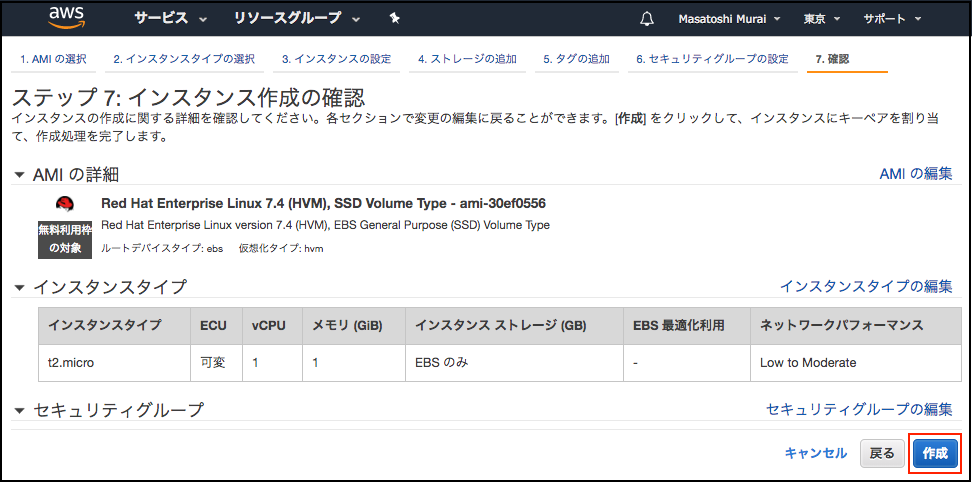

. EC2インスタンス接続用のキーペアーを選択（作成)し インスタンス作成 をクリック
+
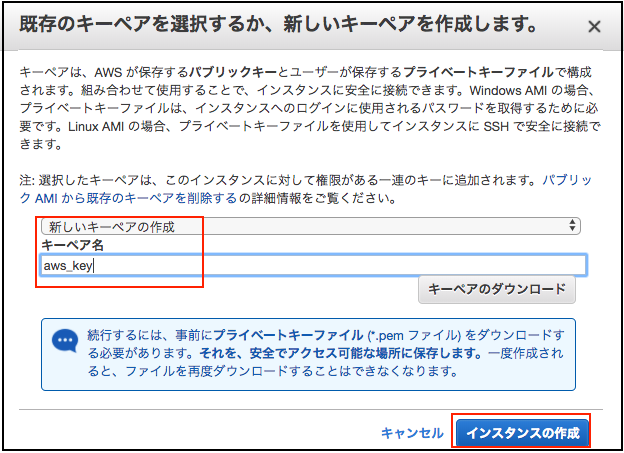

==== セキュリティ設定変更

ブラウザーからサンプルアプリケーションに接続するためにポートの開放を行います

. インスタンスを選択、説明タブ　に記載されている セキュリティグループ　をクリック
+
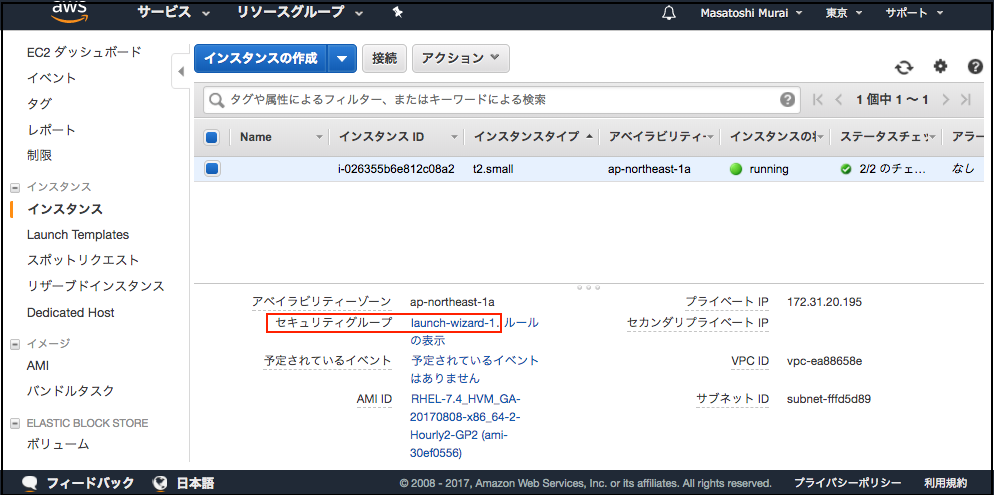
. インバウンド タブを開き、編集 ボタンをクリック
+
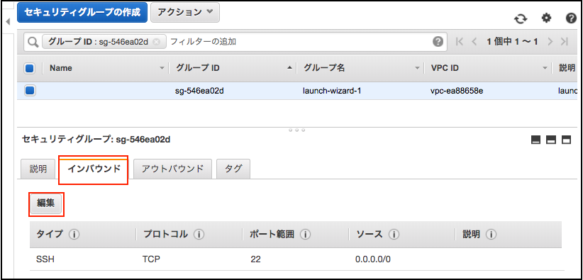
. 8080 / 9990 ポートへのアクセス許可設定を追加
+
追加ボタンをクリックし、入力欄に接続許可設定を追記し保存をクリック
+
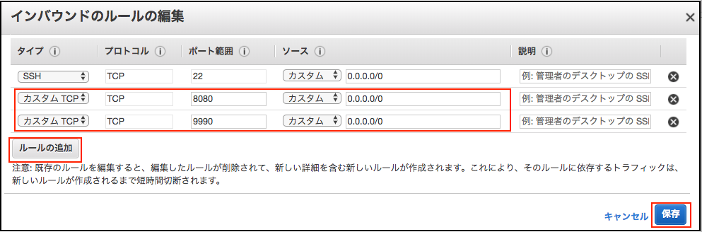

==== ターミナルからEC2インスタンスへ SSH 接続

. EC2インスタンス接続方法確認
+
接続方法を確認するため、対象のインスタンスを選択し、「接続」ボタンをクリックします。
+
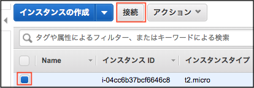
NOTE: 秘密鍵を 600 にしないと、EC2インスタンスへのSSH接続が失敗します。

. 接続方法が記載されたページが起動します
+
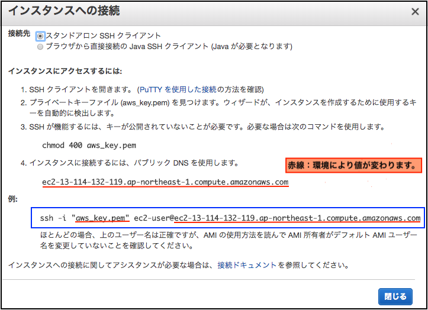

. EC2インスタンスへ ec2-user で SSH 接続
+
上記画面で表示された 例 にあるコマンドを ターミナルから実行します
+
----
$ ssh -i "aws_key.pem" ec2-user@ec2-13-114-132-119.ap-northeast-1.compute.amazonaws.com
----
+
NOTE: Windows環境の場合、puttyなど ターミナルソフトが必要です。

. EC2インスタンスログインの例
+
プロンプトに表示される EC2のプライベートIPでどのインスタンスに接続しているか判別できます
+
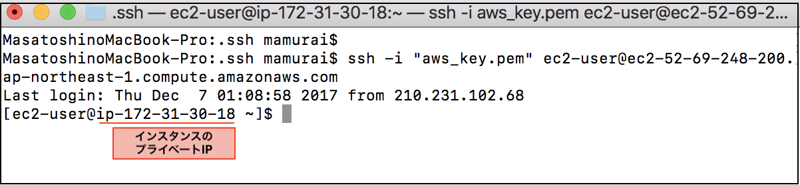

以　上
